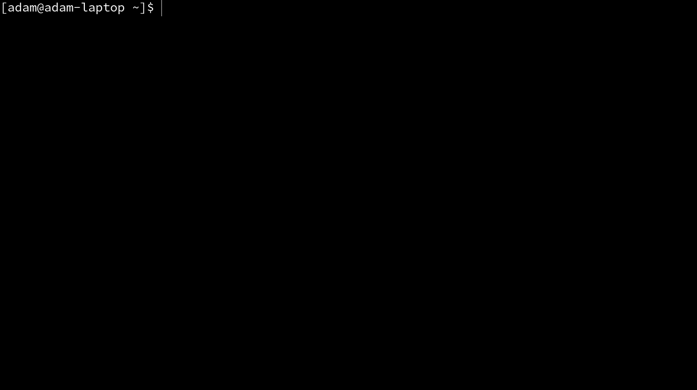

transient
---------

[](https://transient.readthedocs.io/en/latest/?badge=latest)

`transient` is a thin wrapper around QEMU that provides additional features like
downloading and building disk images, shared folders, and SSH support.

Motivation
----------

The primary motivation for the development of `transient` is to have a simple way to
create short-lived virtual machines for testing and development, particularly kernel
and hypervisor development. There are many other tools for creating virtual machines,
such as [vagrant](https://www.vagrantup.com/) or the many [libvirt](https://libvirt.org/)
based solutions. However, these are almost always very stateful. It can be difficult
to create virtual machines using these tools in CI environments, as the state may
not always be appropriately synchronized. Also, these tools can make it more difficult
to supply an existing kernel/initramfs when booting the virtual machine.

Additionally, almost all linux-based virtualization tools ultimately rely on `qemu`.
`transient` makes this dependency transparent, allowing the user the entire flexibility
of QEMU. This can be very helpful, for example, when attempting to setup complex virtual
networking situations which may be difficult to express in the abstractions provided by
other tools.

Installation
------------

`transient` is available on [PyPI](https://pypi.org/project/transient/), so the latest
release can be installed with `pip install transient`. It is also available from
[GNU Guix](http://guix.gnu.org/), and can be installed with 
`guix install python-transient`. To install `transient` from source, clone this 
repository and run `pip install -e '.[dev]'` from the project root. As always, 
the usage of python [virtual environments](https://docs.python.org/3/tutorial/venv.html)
is recommended for a development setup. The development environment can also 
be built by running `make dev` from the project root.

`transient` has very few dependencies. On Ubuntu, these can be installed by running
`apt-get install ssh qemu-system-x86 python3-pip`.

Documentation
-------------

Documentation for `transient` is available on [Read the Docs](https://transient.readthedocs.io/en/latest/).

Quick Start
-----------

`transient` is primarily a wrapper for QEMU. It supplies a small set of flags that
are used to add additional features to the VM being started. As the name implies,
it is almost completely stateless. This avoids problems that can sometimes occur
with `libvirt` based tools becoming 'unsynchronized' with the real system state.

For example, in the following command, the flags before the `--` are passed to
`transient`. The remaining arguments are passed directly to QEMU. This example
will cause `transient` to download and run a Centos7 VM (from the Vagrant Cloud)
with 1GB of memory using a text console. This virtual machine will be automatically
shut down on exit and its disk will be destroyed.

```
transient run \
   -image centos/7:2004.01 \
   -- \
   -nographic -enable-kvm -m 1G
```

`transient` also supports a `vagrant` style SSH connection. This will start the
virtual machine and connect standard input and output to an SSH connection
with the machine, instead of the serial console. However, when this connection
is closed, the machine will be automatically shut down (unlike `vagrant`). For
example:

```
transient run \
   -ssh-console \
   -image centos/7:2004.01 \
   -- \
   -enable-kvm -m 1G
```

The `-ssh-console` flag depends on the image having the normal vagrant keypair
trusted for the `vagrant` user.

Building Images
---------------

One side-effect of the development of `transient` was to create a Dockefile-like
declarative file that can be used to build virtual machine disk images. For example,
the file below would build a Centos 7 image based on the existing `vagrant` image
`centos/7:2004.01` but with `nano` installed and a hostname change:

```
FROM centos/7:2004.01
RUN yum install -y nano
RUN echo 'myhostname' > /etc/hostname
```

For additional information on building images, see the
[Building Images page](https://transient.readthedocs.io/en/latest/images/building/)
of the docs.

License
-------

This project is licensed under the terms of the MIT license. See the LICENSE
file for details
